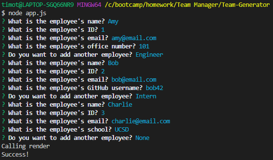
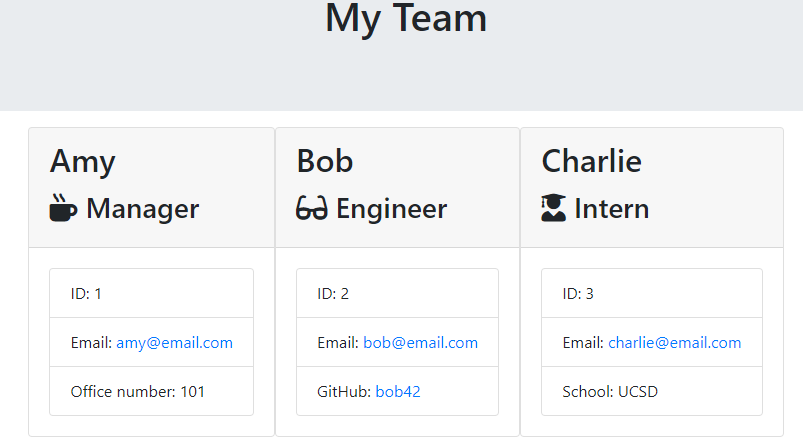

# Good-Readme-Generator

## Description 
This is homework 10, a program to generate an html file to list members on a team.

## Table of Contents 
[Installation](#installation)

[Usage](#usage)

[License](#license)

[Contributing](#contributing)

[Tests](#tests)

[Questions](#questions)
## Installation
Download the source code, then in the folder with app.js run "npm install".

## Usage
In the folder with app.js run "node app.js". Answer the prompts as they appear. It will continue to run until you select "None" for employees to add. After the prompts end the html file in the output folder will have the formatted team list.

## License
This is licensed under the [MIT license](https://choosealicense.com/licenses/mit/).

## Contributing
Feel free to contribute

## Tests
No tests at the moment

## Questions
GitHub: https://github.com/tober65
Email: timothy.ober@gmail.com
